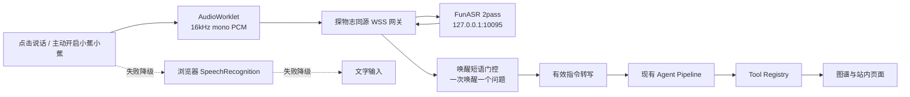

# FunASR 本地语音识别部署与运维

## 当前实现

语音有“点击说话”和用户主动开启的“小蕉小蕉”唤醒两种入口。唤醒默认关闭；开启后，浏览器通过 AudioWorklet 把 16kHz、单声道、16-bit PCM 发送到本站同源 `/api/voice/stream`，Node 网关再转发到服务器本机 FunASR WebSocket 2pass 服务。识别到“小蕉小蕉”后只处理紧随其后的一个问题，完成后重新等待下一次唤醒，不开放免唤醒连续追问。

当前是“服务器本地 FunASR 短片段识别 + 前端短语门控”，不是浏览器端离线 KWS：开启期间音频会发送到项目自己的服务器，但不会发送到无关第三方，也不保存原始音频。页面进入后台、组件销毁、用户关闭唤醒或权限中断时会停止采集。若项目以后要求“唤醒前音频完全不离开设备”，应在现有适配层替换为浏览器 WASM KWS，不能把当前方案描述为本机检测。



## 接口

- `GET /api/voice/config`：返回服务商、音频格式、隐私和唤醒词状态。
- `POST /api/voice/session`：签发 5 分钟短期语音 session。
- `WS /api/voice/stream`：同源 PCM 流与转写事件。
- `GET /api/voice/health`：只返回 `reachable`、`down` 或 `disabled` 等裁剪状态。
- `POST /api/voice/session-token`：兼容旧入口，实际签发同源 session。

FunASR 内部地址只在服务端环境变量 `VOICE_FUNASR_WS_URL` 中出现，默认 `ws://127.0.0.1:10095`。

## 环境变量

复制 `.env.example` 中的语音配置到服务器环境：

```text
VOICE_STT_PROVIDER=funasr-local
VOICE_FUNASR_WS_URL=ws://127.0.0.1:10095
VOICE_ALLOWED_ORIGIN=
VOICE_MAX_DURATION_SECONDS=30
VOICE_MAX_AUDIO_BYTES=4000000
VOICE_FUNASR_CHUNK_SIZE=5,10,5
VOICE_FUNASR_CHUNK_INTERVAL=10
```

`VOICE_WAKE_WORDS` 默认是“小蕉小蕉”，可用逗号配置最多四个候选词。回滚时可设为 `VOICE_STT_PROVIDER=browser`；文字输入不依赖该配置。浏览器兼容识别只作降级，不能保证所有浏览器都支持持续唤醒。

## FunASR 部署

使用 `deploy/funasr/docker-compose.yml` 模板。模板已固定当前 CPU 在线镜像、2pass 的 VAD/在线/离线/标点/ITN 参数，并挂载 `hotwords.txt`。部署前仍必须从 FunASR 官方 Runtime 文档核对镜像 tag、模型 revision、CPU 能力与许可证。FunASR 只绑定 `127.0.0.1:10095`，不通过 Nginx直接暴露。

```bash
cd /var/www/sh-crafted/deploy/funasr
cp -n .env.example .env
mkdir -p models
sudo docker compose pull
sudo docker compose up -d
sudo docker compose ps
sudo docker compose logs --tail=120 funasr
```

`docker compose up -d` 可重复执行。不要重复执行同名 `docker run --name sh-crafted-funasr`。截图中的 `Conflict. The container name "/sh-crafted-funasr" is already in use` 说明旧容器已经存在，不代表需要再创建一个：

```bash
sudo docker ps -a --filter 'name=^/sh-crafted-funasr$'
sudo docker start sh-crafted-funasr     # 状态为 Exited 时
sudo docker logs --tail=120 sh-crafted-funasr
sudo ss -lntp | grep 10095
```

若旧容器配置不正确并决定迁移到 Compose，先停止并改名保留回退，再启动 Compose，避免直接删除：

```bash
sudo docker stop sh-crafted-funasr
sudo docker rename sh-crafted-funasr sh-crafted-funasr-manual-backup
cd /var/www/sh-crafted/deploy/funasr
sudo docker compose up -d
```

首次启动会下载多组模型。2GB 内存机器属于高风险配置，应先用 `free -h`、`docker stats` 和 `dmesg -T | grep -i oom` 观察实际峰值；已有约 2GB swap 只能降低直接 OOM 的概率，不能替代内存和延迟实测。

生产站点若使用 HTTPS，必须在 Nginx 合并 `deploy/nginx/sh-crafted-voice.conf.example`，浏览器连接使用 WSS。不要覆盖现有站点的其他 location。

## 测试

```bash
npm run voice:test
npm run voice:test-protocol
npm run voice:test-api -- --base=http://127.0.0.1:7100
FUNASR_INTEGRATION_TEST=1 npm run voice:test-integration
```

真实 FunASR 未启动时，集成测试会明确失败或跳过，不伪造“服务正常”。

## 隐私与日志

默认不保存原始音频，不永久保存转写文本。日志仅记录 request_id、会话状态、时长、延迟和错误码。生产环境不得记录完整 PCM、音频设备名称或未经脱敏的完整转写。

## 故障排查

1. `/api/voice/config` 检查 provider 是否为 `funasr-local`。
2. `/api/voice/session` 检查是否能签发短期 session。
3. 检查 FunASR 是否监听 `127.0.0.1:10095`。
4. 检查 Node 日志中的 `FUNASR_UNAVAILABLE`、`VOICE_UPSTREAM_TIMEOUT` 和 `VOICE_PROTOCOL_ERROR`。
5. 浏览器权限被拒绝时，在地址栏的网站设置中恢复权限。
6. FunASR 故障时设置 `VOICE_STT_PROVIDER=browser`，重启 Node 服务即可回滚。
7. 唤醒两次后出现 `VOICE_RATE_LIMITED` 时，确认服务器已部署包含“消费后释放短期 session 配额”修复的当前版本。

## 上线验收

1. HTTPS 页面首次不访问麦克风；点击开启后才出现权限请求。
2. 分别测试“小蕉小蕉”单独说、以及“小蕉小蕉，我想看一下还有什么象牙非遗”连句说。
3. 每次只执行一个问题；完成后状态回到“等待唤醒词”。
4. 切到后台后显示暂停且麦克风轨道停止；回到页面需用户点击恢复。
5. 连续完成至少 10 次唤醒，不出现会话限流、连接泄漏或重复执行。
6. 拒绝权限、FunASR 停机和网络断开时，文字输入与知识星图仍可使用。

## 回滚

```bash
VOICE_STT_PROVIDER=browser npm run start
```

或在 `.env` 中修改后重启探物志。停止 FunASR 容器不会影响图谱、详情页、文字智能体和管理员功能。
