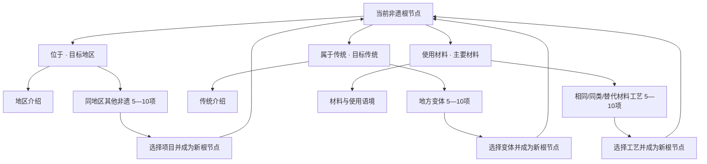
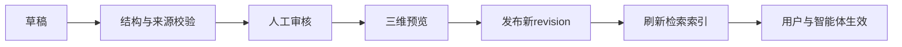
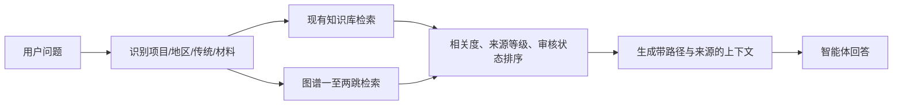

# 探物志 三维非遗知识图谱实施方案

| 文档项 | 内容 |
| --- | --- |
| 文档编号 | SHC-KG-PLAN-001 |
| 版本 | v1.0 |
| 状态 | 待评审 |
| 适用范围 | 工艺完成页、知识图谱接口、管理员后台、智能体知识检索 |
| 目标读者 | 产品、视觉、前端、后端、内容研究、审核、测试、运维人员及协作 AI |
| 最后更新 | 2026-08-05 |

## 1. 文档约定

### 1.1 规范用语

- **必须（MUST）**：发布前必须满足，缺失即不通过验收。
- **应该（SHOULD）**：原则上必须满足；偏离时需要在评审记录中说明原因。
- **可以（MAY）**：可根据进度、数据量或设备能力选择实现。
- 文档中的示例只用于说明结构；没有来源的示例不得直接作为正式内容发布。

### 1.2 需求编号

| 前缀 | 范围 |
| --- | --- |
| KG-P | 产品与信息架构 |
| KG-UX | 用户交互 |
| KG-VD | 视觉设计 |
| KG-D | 数据与证据 |
| KG-API | 服务端接口 |
| KG-A | 管理员后台 |
| KG-AI | 智能体 |
| KG-QA | 测试与验收 |

### 1.3 文档维护标准

1. 需求变化必须更新版本号、变更记录、受影响模块和验收项。
2. 数据字段变化必须同时更新数据字典、接口示例、校验规则和迁移说明。
3. 新增关系类型必须经过产品、内容审核和技术三方确认；不得由采集 AI 自行扩充。
4. 所有正式节点和关系必须能够追溯到来源，不得以“常识”替代证据。
5. 交付文档中的截图、原型和测试结果必须注明对应提交号或版本号。

### 1.4 变更记录

| 版本 | 日期 | 变更 | 作者/责任人 |
| --- | --- | --- | --- |
| v1.0 | 2026-08-05 | 建立三分支图谱、交互、数据、后台、智能体和实施规范 | 待填写 |

## 2. 项目目标

工艺完成后，用户不再只查看成品模型和静态资料，而是以完成品为知识根节点，通过三条固定路径持续探索非遗之间的联系：

1. **位于**：进入地区介绍，并浏览该地区的其他非遗项目。
2. **属于传统**：进入传统体系，并浏览不同地区的项目变体。
3. **使用材料**：进入材料介绍，并浏览使用相同、同类或替代材料的其他工艺。

任意相关非遗被点击后，都可以成为新的根节点，并重新出现上述三个入口。

### 2.1 成功标准

- 用户在不阅读帮助文档的情况下，能够理解三个入口的含义。
- 每次画面只突出一个根节点和一个关系层级，不出现不可读的全量关系网。
- 所有公开节点、摘要和关系都有可访问的来源链接与审核状态。
- 管理员可以完成节点、关系、来源的增删改审，并在发布前预览。
- 智能体可以读取当前节点、当前分支、探索路径和证据，解释“为什么有关联”。
- WebGL不可用、用户开启减少动态效果或使用窄屏设备时，仍能完整浏览内容。

### 2.2 非目标

- 第一版不建设通用百科式自由关系网络。
- 第一版不把人物、保护单位、作品、年代作为根节点的第四或第五主分支。
- 第一版不一次性渲染全部图谱节点。
- 第一版不使用无来源的自动推断关系作为正式内容。
- 第一版不因“每层需要5—10项”而虚构项目或关系。

## 3. 锁定的信息架构

### 3.1 三个入口是界面门户，不是知识实体

“位于”“属于传统”“使用材料”只用于组织界面，不存成图谱节点。实际图谱中保存的是地区、传统、材料和非遗项目。

根节点界面示例：

```text
七宝皮影戏
├── 位于 · 闵行区
├── 属于传统 · 中国皮影戏
└── 使用材料 · 兽皮、纸板
```

这样可以避免产生名称相同、没有知识内容的“位于”节点，同时保证视觉上始终只有三个主入口。

### 3.2 递归探索结构



### 3.3 固定实体和关系

第一版只允许四种可探索实体：

| 实体 | 代码 | 说明 |
| --- | --- | --- |
| 非遗项目 | `heritage` | 可成为根节点的具体项目或地方变体 |
| 地区 | `region` | 行政区或经审核的文化地理区域 |
| 传统 | `tradition` | 高于具体地方项目的传统体系 |
| 材料 | `material` | 工艺直接使用的主要材料或合规替代材料 |

允许的直接关系：

| 关系 | 代码 | 起点 → 终点 |
| --- | --- | --- |
| 位于 | `LOCATED_IN` | heritage → region |
| 属于传统 | `BELONGS_TO_TRADITION` | heritage → tradition |
| 使用材料 | `USES_MATERIAL` | heritage → material |
| 使用替代材料 | `USES_ALTERNATIVE_MATERIAL` | heritage → material |

同地区、同传统和同材料的项目列表由服务器反向查询生成，不重复保存为大量两两关系。

## 4. 用户体验规范

### 4.1 页面入口

完成作品后按以下顺序呈现：

1. 播放现有完成反馈特效。
2. 成品实体模型进入中央。
3. 标题“项目名称”在模型上方稳定出现。
4. 三个关系入口从模型周围依次浮现。
5. 资料侧栏改为悬浮详情层，不再永久占据三维舞台宽度。

### 4.2 根节点状态

| 元素 | 规范 |
| --- | --- |
| 中央模型 | 使用当前完成品GLB；保持旋转、缩放、粒子下落与点击爆散能力 |
| 项目标题 | 必须完整显示；使用DOM投影标签，不能烘焙成模糊贴图 |
| 三个入口 | 保持稳定方位；显示关系名称和目标名称 |
| 引导文字 | 只显示“选择一条关系继续探索”，不增加主题化空话 |
| 背景 | 延续当前江南雾气、砂色和水墨背景，不切换深色宇宙背景 |

推荐固定方位：

- 左上：位于
- 右上：属于传统
- 下方：使用材料

方位固定可以形成操作记忆，重新选择根节点时不得随机打乱。

### 4.3 分支状态

进入任一分支后：

1. 相机沿弧线飞向目标实体。
2. 原根节点缩小并进入探索路径，不立即销毁。
3. 目标实体成为视觉中心。
4. 中央上方显示实体大标题。
5. 周围仅展示5—10个可继续点击的非遗节点。
6. 打开详情时使用悬浮面板覆盖舞台边缘，不改变三维画布尺寸。

### 4.4 三个分支的内容差异

#### 位于

中央内容：

- 地区名称
- 80—200字地区介绍
- 非遗保护概况
- 来源与审核等级

周围节点：同地区其他非遗。

#### 属于传统

中央内容：

- 传统名称
- 传统定义与主要表现形式
- 地域传播概况
- 来源与审核等级

周围节点：地方变体或同一传统下的具体项目。

#### 使用材料

中央内容：

- 材料名称及别名
- 材料特性和历史使用语境
- 保护、法律或伦理提示
- 相同材料、同类材料、替代材料的区别

周围节点：使用该材料或合规替代材料的其他工艺。

### 4.5 点击非遗节点

点击周围非遗后：

1. 显示该项目摘要与来源。
2. 用户选择“以此继续探索”后，该项目成为根节点。
3. 重新计算并显示它的三个入口。
4. 探索路径追加该项目。

单击节点不应立即清空当前场景，避免误触导致方向丢失。

### 4.6 详情面板

详情面板必须包含：

- 节点大标题
- 类型和项目级别
- 摘要
- 当前关系说明
- 来源等级与审核状态
- 来源机构
- “查看原文”链接
- “以此继续探索”按钮（仅非遗项目显示）
- 关闭按钮

详情面板不得包含没有实际信息的装饰性标签。

### 4.7 探索路径

桌面端在左上角显示最多8个节点：

```text
七宝皮影戏 → 中国皮影戏 → 唐山皮影戏 → 河北省唐山市
```

要求：

- 点击路径节点可以返回对应场景。
- 提供“返回作品”和“上一步”。
- 超过8项时折叠最早的中间节点，但始终保留初始作品。
- 浏览器前进/后退必须能够恢复探索路径。

### 4.8 加载、空数据和错误状态

| 状态 | 呈现 |
| --- | --- |
| 加载 | 保留当前场景，目标位置显示呼吸墨点和“正在读取关系” |
| 没有关系 | 显示“该分支资料尚待补充”，不得生成占位节点 |
| 只有1—4项 | 显示真实数量，不复制节点凑数 |
| 接口失败 | 保留当前节点，提供“重新加载” |
| 模型失败 | 使用玉石球体或项目封面，不阻断知识浏览 |
| 来源失效 | 节点可保留，但显示“来源链接待复核”并进入后台队列 |

### 4.9 键盘、触控和无障碍

- `Tab`依次聚焦三个入口、周围节点、详情按钮和探索路径。
- `Enter`或空格打开选中节点。
- `Esc`依次关闭详情、返回当前分支、退出图谱。
- 触控节点的可点击区域不得小于44×44 CSS像素。
- 颜色不能单独表达关系类型，必须同时显示关系文字。
- 页面提供与三维节点同步的隐藏语义列表，供读屏软件读取。
- 开启`prefers-reduced-motion`时取消相机飞行，使用300毫秒以内的淡入切换。
- WebGL不可用时切换为二维径向关系图；窄屏下可以进一步降级为层级列表。

## 5. 视觉设计规范

### 5.1 设计方向

视觉锚点锁定为 **Organic（有机数字展陈）**。三维知识图谱不是霓虹宇宙，而是从当前玉石模型、江南雾气和水墨线条自然生长出的“知识星系”。

标志性表现：**玉石节点由墨线轨道连接，远层关系被雾化，选中后由虚转实。**

### 5.2 必须复用的全站令牌

| 用途 | 令牌/值 |
| --- | --- |
| 主表面 | `--sand: #E8DCC7` |
| 深砂层 | `--sand-deep: #DECFB4` |
| 结构色 | `--moss: #606C38` |
| 次级节点 | `--sage: #8B9D83` |
| 传统分支提示 | `--ochre: #C08E3A` |
| 交互与警示 | `--terracotta: #C66B3D` |
| 正文 | `--ink: #2B3327` |
| 次级正文 | `--ink-soft: #4A5344` |
| 圆角 | `--radius-md: 18px`、`--radius-lg: 24px` |
| 动效 | `--t-med: 380ms`、`--t-slow: 500ms` |
| 标题字体 | `--serif` |
| 正文字体 | `--sans` |

不得引入霓虹蓝、纯黑宇宙、冷灰面板或新的字体体系。

### 5.3 节点层级

| 层级 | 形式 |
| --- | --- |
| 当前根节点 | 实体GLB或较大的半透明玉石节点，标题最大 |
| 三个关系入口 | 中等玉石节点，外侧有克制的墨晕呼吸 |
| 可点击非遗 | 较小玉石节点或有来源缩略图的半透明节点 |
| 二级预告 | 低透明度光点，不显示详情，不接受点击 |
| 历史路径 | 更小、更淡，保留标题或序号 |

### 5.4 连线

- 使用细而不均匀的墨线或贝塞尔曲线。
- 默认透明度建议0.16—0.28。
- 当前关系提升至0.55—0.7。
- 不绘制与当前中心无关的所有边。
- 关系文字放在靠近中心的一端，避免沿整条曲线重复。
- 动画是墨线从中心向外生长，不使用高速激光或闪烁。

### 5.5 标题与标签

- 中文节点标题使用DOM覆盖层并投影三维坐标。
- 当前标题使用`--serif`，字重600。
- 周围节点标题使用`--sans`，不得小于13px。
- 标题背景采用半透明砂色和轻微模糊，不能使用纯白卡片。
- 标签碰撞时优先隐藏二级节点，再隐藏最远节点；当前标题永不隐藏。

### 5.6 动效节奏

| 动作 | 建议时长 |
| --- | --- |
| 三个入口出现 | 380—500ms，依次错开80ms |
| 节点选中浮起 | 300—380ms |
| 相机切换 | 700—1000ms |
| 详情出现 | 380ms |
| 墨线生长 | 500—800ms |
| 节点空闲呼吸 | 4—7秒低幅循环 |

动效必须可以被用户输入打断，相机不得锁死。

## 6. 数据规范

### 6.1 存储结构

Git内保存审核后的初始种子：

```text
data/heritage-graph/
├── nodes.jsonl
├── edges.jsonl
├── facts.jsonl
├── sources.json
└── schema-version.json
```

服务器保存管理员的在线版本：

```text
/var/lib/sh-crafted/graph.json
```

运行时合并规则：

1. Git种子提供初始节点和来源。
2. 在线版本按稳定ID覆盖Git种子。
3. 在线新增内容只写`graph.json`，不写Git目录。
4. 部署代码不得覆盖`graph.json`。
5. 图谱数据拥有独立`revision`，采用现有后台相同的乐观并发控制。

### 6.2 ID规范

```text
heritage_<地区或机构>_<英文短名>
region_<行政区划英文短名>
tradition_<英文短名>
material_<英文短名>
edge_<from>_<predicate>_<to>
fact_<subject>_<三位序号>
src_<机构>_<主题>_<年份或序号>
```

要求：

- 只使用小写英文字母、数字和下划线。
- ID发布后不得因标题调整而改变。
- 别名进入`aliases`，不能创建重复节点。
- 行政区调整通过`valid_from`和`valid_to`记录，不复用旧ID表达新地区。

### 6.3 节点结构

```json
{
  "id": "heritage_qibao_shadow",
  "type": "heritage",
  "title": "七宝皮影戏",
  "aliases": ["七宝皮影"],
  "summary": "经审核的80—200字摘要。",
  "category": "传统戏剧",
  "level": "待按正式名录填写",
  "image_url": "",
  "model_url": "",
  "source_ids": ["src_example"],
  "authority_tier": "A",
  "review_status": "verified",
  "published": true,
  "updated_at": "2026-08-05T00:00:00.000Z"
}
```

### 6.4 关系结构

```json
{
  "id": "edge_qibao_shadow_located_in_minhang",
  "from": "heritage_qibao_shadow",
  "predicate": "LOCATED_IN",
  "to": "region_minhang",
  "description": "说明这条关系的直接证据。",
  "source_ids": ["src_example"],
  "authority_tier": "A",
  "review_status": "verified",
  "display_priority": 80,
  "published": true
}
```

### 6.5 事实结构

```json
{
  "id": "fact_tradition_shadow_001",
  "subject_id": "tradition_chinese_shadow_puppetry",
  "statement": "一条可以独立核验的事实陈述。",
  "source_ids": ["src_example"],
  "authority_tier": "A",
  "review_status": "verified"
}
```

### 6.6 来源结构

```json
{
  "source_id": "src_ihchina_tangshan_shadow",
  "title": "皮影戏（唐山皮影戏）",
  "publisher": "中国非物质文化遗产网",
  "url": "https://www.ihchina.cn/project_details/13392/",
  "source_type": "national_register",
  "authority_tier": "A",
  "published_at": "",
  "checked_at": "2026-08-05",
  "license_note": "仅保存改写摘要与原文链接"
}
```

### 6.7 来源等级与审核状态

来源等级：

| 等级 | 范围 |
| --- | --- |
| A | 国家/国际名录、法律法规、政府正式公报、UNESCO |
| B | 省市区政府、文化主管部门、官方保护单位、权威学术出版物 |
| C | 博物馆、官方文旅平台、主流媒体专题 |
| D | 社区投稿、个人网站、自媒体，只作为待核验线索 |

审核状态：

| 状态 | 含义 | 是否公开 |
| --- | --- | --- |
| `verified` | 已由管理员核验 | 是 |
| `supported` | 有来源支持，等待最终复核 | 可配置 |
| `needs_review` | 自动采集或AI候选 | 否 |
| `conflicted` | 来源相互冲突 | 否 |
| `rejected` | 已确认不采用 | 否 |
| `archived` | 历史版本 | 否 |

来源等级不能代替人工审核；A级来源自动抽取的错误内容仍然不能直接发布。

### 6.8 自动推导关系

以下结果由查询生成，不写入边表：

- 同属一个地区
- 同属一个传统
- 使用相同材料
- 使用同类材料

界面必须标注“根据已核验关系归纳”，并可以展开查看推导路径。

## 7. 资料采集规范

### 7.1 每个非遗项目的最低交付

- 1个项目节点。
- 1条`LOCATED_IN`关系。
- 1条`BELONGS_TO_TRADITION`关系；确实无法归类时标记待审核，不得臆造传统。
- 1—3条`USES_MATERIAL`关系。
- 3—8条独立事实。
- 每个节点、关系和事实至少1个来源。
- 80—200字原创改写摘要。

### 7.2 每个地区的最低交付

- 地区名称、别名、行政层级。
- 80—200字地区介绍。
- 官方非遗保护或名录说明。
- 5—10项同地区非遗；不足时提交真实数量。
- 每项的标准名称、类别、级别和来源。

### 7.3 每个传统的最低交付

- 传统的标准名称和定义。
- 主要表现形式和传播范围。
- 5—10个地方变体；不足时提交真实数量。
- 变体间可以核验的差异摘要。
- 不得将“题材相似”直接写成“同一传统”。

### 7.4 每种材料的最低交付

- 标准名称、别名和材料分类。
- 物理特性与传统使用方式。
- 相关法律、保护和伦理说明。
- 5—10项使用相同、同类或替代材料的工艺。
- 必须明确关系是“相同材料”“同类材料”还是“替代材料”。

### 7.5 采集优先级

1. 国家级非遗代表性项目名录及代表性传承人资料。
2. UNESCO非物质文化遗产名录。
3. 国家、上海市及各区政府正式名录和公报。
4. 文化主管部门、保护单位和博物馆。
5. 学术出版物与权威媒体。
6. 其他页面只作为检索线索。

### 7.6 内容与版权

- 只保存事实性字段、原创改写摘要和原文链接。
- 不复制网页长段落。
- 图片、音频、视频和三维模型必须单独记录授权或使用依据。
- 无法确认授权的媒体不得自动下载或进入正式页面。
- 涉及象牙等受监管材料时必须附现行法律和保护语境，不提供交易、购买或商业加工引导。

### 7.7 第一批参考入口

- [中国非物质文化遗产网：唐山皮影戏](https://www.ihchina.cn/project_details/13392/)
- [UNESCO：中国皮影戏](https://ich.unesco.org/en/RL/chinese-shadow-puppetry-00421)
- [静安区第五批区级非物质文化遗产代表性项目名录](https://www.jingan.gov.cn/govxxgk/JA0/2025-01-21/672b28b7-ca93-4258-97ad-094ed032cbd9.html)
- [上海市第七批非物质文化遗产代表性项目名录](https://www.shanghai.gov.cn/nw12344/20240409/4da467e2f2f3495fa4380adfbe87636d.html)
- [中国非物质文化遗产网：象牙雕刻](https://www.ihchina.cn/project_details/14002.html)
- [国务院办公厅关于有序停止商业性加工销售象牙及制品活动的通知](https://www.mofcom.gov.cn/zcfb/zgdwjjmywg/art/2017/art_4be6156f14004b149141161a96ffa952.html)

## 8. API规范

### 8.1 公开接口

```text
GET /api/graph/heritage/:id
GET /api/graph/heritage/:id/root
GET /api/graph/regions/:id
GET /api/graph/traditions/:id
GET /api/graph/materials/:id
GET /api/graph/search?q=<query>&type=<type>&limit=<n>
```

`/root`必须一次返回：

- 根项目基本信息。
- 三个门户的目标实体。
- 每个门户的可用状态和真实结果数。
- 首屏所需的最小来源信息。

地区、传统和材料接口最多返回10个相关非遗，支持游标分页，但第一版界面不同时展示下一页。

### 8.2 管理接口

```text
POST   /api/admin/graph/nodes
PATCH  /api/admin/graph/nodes/:id
DELETE /api/admin/graph/nodes/:id
POST   /api/admin/graph/edges
PATCH  /api/admin/graph/edges/:id
DELETE /api/admin/graph/edges/:id
POST   /api/admin/graph/facts
PATCH  /api/admin/graph/facts/:id
POST   /api/admin/graph/sources
PATCH  /api/admin/graph/sources/:id
POST   /api/admin/graph/publish
```

写接口必须：

- 校验管理员会话和同源请求。
- 校验`revision`，防止静默覆盖。
- 限制文本长度、数组数量和URL协议。
- 拒绝悬空节点、未知关系和重复边。
- 删除节点时检查所有入边和出边，只允许软删除。

### 8.3 响应示例

```json
{
  "revision": "graph_revision_id",
  "root": {
    "id": "heritage_qibao_shadow",
    "title": "七宝皮影戏"
  },
  "portals": [
    {
      "kind": "location",
      "label": "位于",
      "target": { "id": "region_minhang", "title": "闵行区" },
      "result_count": 8,
      "available": true
    }
  ]
}
```

## 9. 前端技术方案

### 9.1 模块拆分

建议新增：

```text
js/heritage-graph.js          图谱状态、查询和路径
js/heritage-graph-3d.js       Three.js场景、节点、连线、相机
js/heritage-graph-labels.js   DOM标题投影与碰撞控制
js/views/graph-admin.js       管理员图谱页面
css/heritage-graph.css        图谱专用样式
```

`js/views/craft.js`只负责在完成状态挂载和销毁图谱，不继续堆积全部实现。

### 9.2 场景预算

- 同时可点击节点不超过10个。
- 总可见节点不超过24个。
- 总可见连线不超过40条。
- 只有当前完成品使用GLB；地区、传统和材料优先使用程序化玉石节点。
- 不为每个相关非遗自动加载GLB；只显示轻量图形或已授权缩略图。
- 节点离开可见场景后释放标签、纹理引用和交互对象。

### 9.3 布局策略

采用确定性的语义轨道，不采用完全随机的力导向图：

- 相同数据每次进入时位置一致。
- 三个门户位置固定。
- 分支节点按`display_priority`和稳定ID计算位置。
- 节点数量变化时保留主要节点的大致方位。
- 远层节点高度略高、透明度略低，延续地图远山的空间语言。

### 9.4 状态机

```text
complete_enter
→ root_ready
→ portal_loading
→ branch_ready
→ detail_open
→ heritage_preview
→ root_switching
→ root_ready
```

任何异步回调在写入DOM或Three场景前都必须确认当前场景仍然有效。

### 9.5 URL与历史记录

建议使用查询参数或子路由保存状态：

```text
#/craft/SHIH_0007?graph=tradition_chinese_shadow&trail=heritage_qibao_shadow
```

刷新页面后应恢复当前节点和探索路径；无效ID回退到作品根节点。

## 10. 管理员后台方案

### 10.1 页面结构

新增“知识图谱管理”，包含：

1. 节点管理
2. 关系管理
3. 来源管理
4. 审核队列
5. 数据质量报告
6. 三维局部预览

### 10.2 非遗编辑器

管理员必须能够：

- 修改名称、别名、摘要、类别和级别。
- 选择唯一地区。
- 选择唯一主传统。
- 选择1—3种主要材料。
- 查看三个分支将自动生成哪些相关项目。
- 设置每个分支的展示优先级和隐藏项。
- 绑定来源和审核状态。

### 10.3 地区、传统和材料编辑器

共同能力：

- 编辑标题、别名和摘要。
- 管理来源。
- 查看反向关联项目。
- 合并重复节点。
- 预览用户进入该分支后的星图。
- 检查是否达到建议的5—10项。

材料编辑器额外支持：

- 材料分类。
- 替代材料映射。
- 法律与伦理说明。
- 是否允许在公开页面展示。

### 10.4 审核队列

自动列出：

- 无来源节点或关系。
- 只有D级来源的内容。
- `needs_review`和`conflicted`内容。
- 失效来源链接。
- 名称疑似重复节点。
- 指向不存在实体的关系。
- 缺少三个门户之一的非遗项目。
- 分支不足5项的节点。
- 超过10项但未设置展示优先级的分支。

### 10.5 发布流程



发布失败时保持旧revision继续服务，不能把半成品暴露给用户。

## 11. 智能体接入方案

### 11.1 前端上下文

```json
{
  "root_heritage_id": "heritage_qibao_shadow",
  "current_node_id": "tradition_chinese_shadow_puppetry",
  "current_branch": "tradition",
  "visible_node_ids": [
    "heritage_tangshan_shadow",
    "heritage_huaxian_shadow"
  ],
  "exploration_trail": [
    "heritage_qibao_shadow",
    "tradition_chinese_shadow_puppetry"
  ]
}
```

### 11.2 检索流程



### 11.3 回答约束

- 优先使用`verified`且有A/B级来源的内容。
- 必须说明关系路径，例如“七宝皮影戏 → 属于中国皮影戏传统 → 唐山皮影戏也是该传统的地方变体”。
- 使用外部事实时必须附来源编号或链接。
- `needs_review`不得表达为定论。
- 智能体不得根据材料相同擅自判断两个项目具有传承关系。
- 智能体不得推荐象牙交易、购买或商业加工。

### 11.4 索引更新

管理员发布后：

1. 生成节点标题、摘要、事实和关系路径的搜索片段。
2. 原子替换内存图谱索引。
3. 保留上一个索引用于失败回滚。
4. 记录索引revision，与图谱revision一致。

## 12. 任务拆解与交付顺序

### 12.1 WBS总表

| 工作包 | 主要任务 | 依赖 | 交付物 | 建议工期 |
| --- | --- | --- | --- | --- |
| KG-00 | 规范确认与原型范围锁定 | 无 | 本方案评审版 | 1—2天 |
| KG-10 | 七宝皮影、象牙篾丝双试点资料 | KG-00 | 结构化节点、关系、事实、来源 | 5—8天 |
| KG-20 | 图谱数据层与校验器 | KG-00 | 数据目录、Schema、校验脚本 | 4—6天 |
| KG-30 | 公开与管理API | KG-20 | API、持久化、revision、测试 | 5—8天 |
| KG-40 | 三维星图与交互 | KG-20、KG-30 | 根节点、三门户、分支、详情、路径 | 8—12天 |
| KG-50 | 管理员图谱后台 | KG-30 | CRUD、审核、预览、质量报告 | 7—10天 |
| KG-60 | 智能体图谱检索 | KG-20、KG-30 | 图谱召回、路径解释、引用 | 4—6天 |
| KG-70 | 测试、性能、无障碍 | KG-40、KG-50、KG-60 | 自动化测试、验收报告 | 5—7天 |
| KG-80 | 扩充八个项目与发布 | KG-10、KG-70 | 正式数据、部署和回滚记录 | 10—15天 |

### 12.2 KG-00：范围与设计确认

任务：

- 确认三个门户的名称和固定位置。
- 确认项目、地区、传统、材料四类实体。
- 确认第一批只做七宝皮影与象牙篾丝。
- 绘制根节点、地区分支、传统分支、材料分支四张低保真原型。
- 确认桌面、平板、手机和减少动态效果状态。

验收：产品、设计、内容和技术共同签字确认，不再新增第四主分支。

### 12.3 KG-10：内容试点

七宝皮影试点重点：

- 闵行区及同地区其他非遗。
- 中国皮影戏及地方变体。
- 兽皮、纸板及使用相似材料的工艺。

象牙篾丝试点重点：

- 静安区及同地区其他非遗。
- 所属工艺传统的准确定义。
- 象牙、篾丝、替代材料与相关工艺。
- 象牙商业加工销售停止后的保护语境。

验收：

- 每条公开关系有来源。
- 每个摘要为原创改写。
- 不存在重复实体。
- 不为了数量制造弱关联。

### 12.4 KG-20：数据层

任务：

- 创建四个数据文件和Schema版本。
- 编写ID、类型、关系、URL和长度校验。
- 编写重复别名检测。
- 编写悬空边检测。
- 编写来源覆盖率报告。
- 编写Git种子与在线版本合并逻辑。

验收：错误数据不能启动发布流程；校验报告能够定位到文件和行号。

### 12.5 KG-30：服务端

任务：

- 实现根节点聚合接口。
- 实现三种分支反向查询。
- 实现管理员写接口和revision冲突处理。
- 实现软删除和引用保护。
- 实现缓存、分页和输入限制。
- 增加`graph.json`备份与恢复脚本。

验收：服务重启后数据保持；并发保存不会静默覆盖；旧revision能够回滚。

### 12.6 KG-40：三维前端

任务：

- 从`craft.js`拆出独立图谱模块。
- 建立中央模型、三个门户和分支节点。
- 实现DOM标题投影与碰撞处理。
- 实现相机飞行、路径恢复和可中断动画。
- 实现悬浮详情层。
- 实现加载、空数据、错误和模型回退。
- 实现二维和列表降级。

验收：任何层级都能继续进入非遗根节点；返回路径不丢失；详情面板不挤压画布。

### 12.7 KG-50：管理员后台

任务：

- 节点、关系、事实、来源编辑器。
- 地区、传统和材料的反向关联预览。
- 审核队列和数据质量报告。
- 三维局部预览。
- 批量JSONL导入与错误报告。
- 发布、回滚和审计记录。

验收：非开发人员能够新增一个项目并建立三个门户，发布后用户页面即时生效。

### 12.8 KG-60：智能体

任务：

- 接收当前图谱上下文。
- 组合全文检索和图谱一至两跳检索。
- 输出关系路径和来源。
- 对未审核、冲突和敏感材料设置回答约束。
- 管理员发布后热更新索引。

验收：针对“它为什么和唐山皮影有关”等问题，回答包含明确路径和可访问来源。

### 12.9 KG-70：测试

任务：

- 数据Schema和图完整性测试。
- API权限、输入、分页、revision和重启测试。
- 三门户、递归探索、历史返回和错误状态UI测试。
- 管理员增删改审和发布回滚测试。
- 智能体引用和审核约束测试。
- 性能、移动端、键盘和减少动态效果测试。

### 12.10 KG-80：扩充与发布

任务：

- 按同一规范补齐现有八个项目。
- 生成正式来源覆盖率报告。
- 备份线上内容和图谱文件。
- 灰度开放图谱入口。
- 监控接口错误、WebGL错误、节点点击和退出率。
- 验收通过后替换旧完成页侧栏。

## 13. 测试与验收标准

### 13.1 数据验收

- 公开节点来源覆盖率100%。
- 公开关系来源覆盖率100%。
- 不存在悬空边和重复ID。
- 同一实体的别名不产生重复节点。
- 正式数据中不存在`needs_review`、`conflicted`或D级单一来源关系。

### 13.2 交互验收

- 根节点始终只有三个主入口。
- 当前节点大标题在所有支持尺寸下完整可见。
- 每个分支一次展示不超过10项。
- 点击相关非遗后能够成为新根节点。
- 上一步、返回作品和浏览器历史行为一致。
- 详情面板打开前后三维画布尺寸不变。
- 动画过程中再次操作不会造成相机跳跃或页面失控。

### 13.3 性能验收

- 桌面端常规设备目标60fps，低性能或移动设备不低于30fps。
- 同时可见节点不超过24，连线不超过40。
- 分支接口在正常服务器负载下P95目标小于300ms，不包含外部网络抓取。
- 图谱页面不在首屏加载其他项目GLB。
- 离开完成页后释放图谱动画、观察器、DOM标签和GPU资源。

### 13.4 管理员验收

- 能新增、编辑、归档和恢复四类节点。
- 能配置三个固定关系。
- 能维护来源和审核状态。
- 能看到自动生成的同地区、同传统、同材料列表。
- 能在发布前预览。
- 错误数据不能发布。
- 发布失败不会影响线上旧版本。

### 13.5 智能体验收

- 能识别当前根节点和当前分支。
- 能解释两节点之间的关系路径。
- 能引用来源。
- 不把系统推导关系说成官方直接认定。
- 不把待审核内容说成事实。
- 对象牙等敏感材料保持保护和法律语境。

## 14. 发布、监控与回滚

### 14.1 发布前

1. 备份`content.json`、`community.json`和`graph.json`。
2. 运行数据完整性、服务端和UI测试。
3. 记录Git提交号、图谱revision和索引revision。
4. 在预发布环境检查两个试点项目。

### 14.2 灰度策略

- 第一阶段只对七宝皮影和象牙篾丝显示“探索知识图谱”。
- 其他项目继续使用当前完成页。
- 观察错误率、加载时间、点击率、返回率和智能体问题类型。
- 试点稳定后按项目逐个开放。

### 14.3 回滚

- 前端通过功能开关恢复旧完成页。
- 服务端保留上一版`graph.json`和索引。
- 回滚图谱不得回滚管理员的普通内容和社区数据。
- 回滚完成后记录原因、影响节点和修复计划。

## 15. 协作AI交付标准

可以把以下要求直接交给负责资料采集或数据整理的AI：

> 为探物志建立非遗知识图谱资料。每个非遗项目只研究三种关系：位于哪个地区、属于哪个传统、使用哪些材料。每个地区整理地区介绍及5—10项其他非遗；每个传统整理整体介绍及5—10个地方变体；每种材料整理材料介绍、法律伦理说明及5—10项使用相同、同类或替代材料的工艺。每个节点、关系和事实必须附来源ID；每个来源必须包含标题、机构、URL、来源等级和核验日期。优先使用国家非遗名录、UNESCO、政府及文化主管部门资料。不得为了数量虚构关系，不得复制网页长段落，不得使用未确认授权的媒体。输出`nodes.jsonl`、`edges.jsonl`、`facts.jsonl`、`sources.json`和一份校验报告。

AI交付后仍必须由人工完成：

- 实体合并与别名确认。
- 关系类型确认。
- 摘要事实核验。
- 来源等级和审核状态确认。
- 敏感材料法律语境确认。
- 正式发布。

## 16. 待确认事项

以下事项不阻塞双试点开发，但必须在全面扩充前确定：

1. 地区节点只使用行政区，还是允许历史文化区域。
2. 一个项目是否允许设置多个传统；第一版建议只设一个主传统。
3. 材料分类的粒度，例如“兽皮”与“驴皮”是否同时存在。
4. `supported`内容是否允许公开；建议默认不公开。
5. 相关非遗的排序是完全由编辑决定，还是编辑优先级加用户未探索加权。
6. 地区、传统和材料节点是否使用图片；如使用，必须先建立媒体授权字段。

## 17. 完成定义（Definition of Done）

只有同时满足以下条件，本功能才算完成：

- 两个试点的三分支数据已经审核并发布。
- 用户可以从完成品连续探索至少三层并安全返回。
- 每个根节点只显示三个主入口。
- 每个公开节点和关系有来源。
- 三维、二维和列表降级均可使用。
- 管理员可以独立完成维护与发布。
- 智能体能基于图谱解释关系并引用来源。
- 自动化测试、性能检查、无障碍检查和回滚演练通过。
- 线上备份、监控和数据维护责任人已经明确。

## 18. 当前实施审计（2026-08-06）

本节记录当前工作区的实际完成状态，不替代第17节的最终完成定义。

### 18.1 已完成

- 八个现有工艺项目均已接入知识图谱；自动化测试要求每个根项目的一跳可探索邻域不少于24个节点，当前实际为28—37个。
- 完成品可打开全屏三维星图，根节点保持“位于、属于传统、使用材料”三个固定入口。
- 新增独立 `#/graph` 与 `#/graph/:stableId` 入口；地图页顶部“知识星图”位于“数据护照”右侧，可不经过工艺完成流程直接进入。稳定节点路由支持非遗、地区、传统和材料，非非遗目标会选择一项真实关联非遗作为根并展开对应固定分支。
- 分支每组最多显示10个节点，并可通过“上一组/下一组”浏览完整结果，保持单屏场景预算。
- 节点使用纯白半透明星体材质；场景使用白色星点、白色连线和六层疏密天环。节点到中心的距离由稳定 ID 生成确定性随机值，使连线长短自然变化，并保证重新进入、翻页或返回时布局不跳动。
- 节点悬停采用阻尼透明度和缩放过渡：当前节点凝实，其他节点、标签和无关连线降低透明度。
- 支持相关非遗成为新根节点，并提供上一步、返回当前根节点和返回最初作品。
- 独立星图提供键盘可聚焦的当前星点列表、缩放按钮、Escape/手势返回，以及鼠标和捏合拖拽一致的相机旋转；左上 Logo 统一返回初始页 `#/`。
- 全局智能体可将“我想看一下还有什么象牙非遗”解析为稳定材料/传统节点，并通过白名单 `open_node` 跳转到对应星图分支；不会把这类查询误执行为当前作品的材料展开。
- 关闭星图时释放动画帧、观察器、纹理、Three.js材质、控制器和指针事件；真实浏览器销毁测试无残留画布。
- 扩展目录节点与关系保留来源ID、来源标题、来源URL、来源等级和`review_status`；新增资料统一标记为`supported`，不冒充人工核验完成。

### 18.2 部分完成

- 当前数据层为前端Git种子与适配层，结构已独立拆分，但尚未迁移为`data/heritage-graph/*.jsonl`正式目录。
- 当前已把独立入口的选中稳定节点写入URL，可刷新恢复入口目标；分支分页、完整根节点历史尚未全部序列化，浏览器前进和后退仍不能恢复每一个中间镜头状态。
- Three.js不可用时可以退出并保留完成页，但二维径向图和层级列表降级尚未实现。
- 智能体能够读取当前图谱上下文，尚未接入服务端一至两跳图谱检索与图谱revision热更新。

### 18.3 尚未完成

- `/api/graph/*`公开接口、服务端图谱持久化、revision合并、备份和回滚。
- 管理员节点、关系、事实、来源编辑器，以及审核队列、质量报告和发布流程。
- 扩展目录逐条人工复核、重复实体合并、关系描述补充和正式`verified`发布。
- 二维/列表降级、标签碰撞算法和移动端专项验收；当前键盘列表覆盖独立星图的可见节点，但尚未形成二维等价图。
- 线上灰度、性能实测、监控指标、责任人确认和回滚演练。

因此当前状态应定义为：**八项目三维星图前端增强层可验证运行，整体知识图谱平台仍处于分阶段实施中。**
