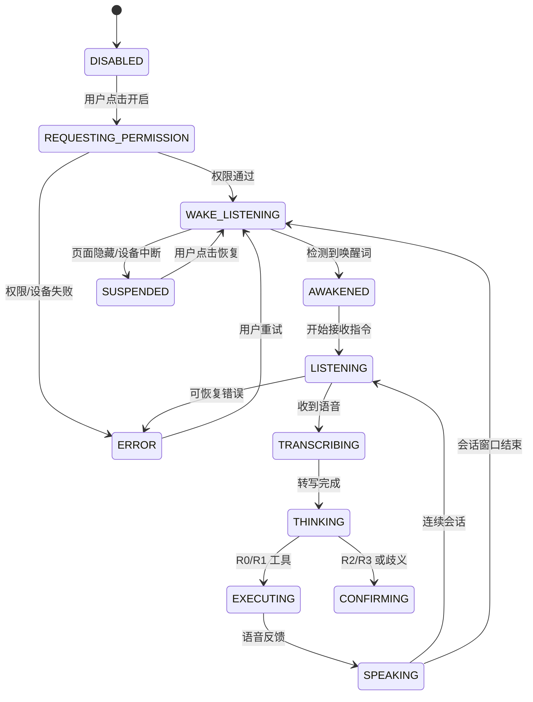

# SH-Crafted 智能体与语音向导实施说明

版本：v0.1 · 2026-08-05  
范围：第一阶段文字工具化、图谱兼容层、点击说话/唤醒适配层

## 1. 当前交付与边界

本次改造保留原有“小蕉”证据检索与 DeepSeek 服务端代理，新增：

- 地图页和非遗详情页统一智能体入口。
- `heritage:`、`region:` 稳定命名空间，映射现有 `SHIH_0001`—`SHIH_0008` 与地区 ID。
- 三分支白名单：`LOCATED_IN`、`BELONGS_TO_TRADITION`、`USES_MATERIAL`。
- 严格参数校验的客户端 Tool Registry；工具执行器只调用页面宿主提供的站内方法。
- 当前页面、根节点、选中节点、可见节点、路径和权限的裁剪上下文。
- 显式语音状态机、点击说话、浏览器 STT/TTS 兼容适配、唤醒词适配接口和页面隐藏暂停。
- 服务端图谱搜索、节点、分支、智能体会话、语音配置接口。

当前图谱增强层只把代码和内容中已有的地区归属作为 `LOCATED_IN`。没有正式来源的传统/材料关系返回空状态；不能把 `category`、摘要文字或模型推断当作正式关系。

## 2. 架构

```mermaid
flowchart LR
  UI[地图页 / 详情页 / 键盘文字输入] --> Agent[agent.js 会话面板]
  Voice[voice-controller
  唤醒词 / 点击说话 / TTS] --> Agent
  Agent --> Resolve[intent-resolver
  指令识别与指代消解]
  Resolve --> Registry[Tool Registry
  Schema + 风险 + 白名单]
  Registry --> Host[页面宿主操作
  hash 路由 / 地图聚焦 / 详情页]
  Registry --> Graph[graph-adapter
  稳定 ID / 三分支]
  Agent --> Search[/api/kb/search
  证据检索]
  Agent --> Model[/api/agent
  服务端模型代理]
  Server[server.mjs] --> GraphAPI[/api/graph/*]
  Server --> Model
  Server --> Admin[HttpOnly 管理会话 / revision]
```

模型只生成或解释文本，不能访问 DOM、构造 URL 或直接改变状态。实际导航必须经过 Registry，再由页面宿主验证节点与当前会话。

## 3. 上下文对象与会话协议

```json
{
  "route": "/craft/SHIH_0007",
  "page_type": "heritage_detail",
  "current_root": { "id": "heritage:SHIH_0007", "type": "heritage", "title": "七宝皮影戏" },
  "active_branch": null,
  "selected_node": { "id": "heritage:SHIH_0007", "type": "heritage", "title": "七宝皮影戏" },
  "visible_nodes": [],
  "breadcrumbs": ["heritage:SHIH_0007"],
  "history": [],
  "available_actions": ["expand_branch", "open_node", "go_back", "read_summary"],
  "voice_state": "DISABLED",
  "user_role": "visitor",
  "locale": "zh-CN",
  "context_revision": "craft:SHIH_0007"
}
```

服务端协议：

- `POST /api/agent/session`：签发短期会话 ID与公开工具清单，不返回模型或语音密钥。
- `POST /api/agent/message`：兼容文本模型协议，响应区分 `type: assistant_message`、`session_state` 与知识库依据。
- `GET /api/agent/context`：返回服务端权限和内容 revision；浏览器 UI 上下文由前端裁剪后提交。
- `GET /api/graph/search?q=&type=&limit=`、`GET /api/graph/node/:id`、`GET /api/graph/node/:id/branches`：只读图谱 API。
- `GET /api/voice/config`：唤醒词和降级能力；`POST /api/voice/session-token` 在未配置实时服务时明确返回未配置，不泄露密钥。

## 4. 语音状态机



| 状态 | 页面反馈 | 进入条件 | 退出/释放 |
| --- | --- | --- | --- |
| `DISABLED` | 语音未开启 | 初始、用户关闭 | 只能由主动点击申请权限 |
| `REQUESTING_PERMISSION` | 正在申请麦克风权限 | 用户点击开启或点击说话 | 成功进入监听，失败进入错误 |
| `WAKE_LISTENING` | 等待唤醒词 | 权限通过、连续会话结束 | 唤醒、暂停、关闭 |
| `AWAKENED` | 已唤醒，请说话 | 唤醒词成功 | 5—8 秒无输入回等待 |
| `LISTENING` | 正在聆听 | 点击说话/唤醒后 | 转写、停止、暂停 |
| `TRANSCRIBING` | 正在识别 | 收到语音 | 思考、重试、错误 |
| `THINKING` | 正在思考 | 文字提交 | 确认、执行、回答 |
| `CONFIRMING` | 等待确认 | 外部来源或高风险操作 | 明确确认或取消 |
| `EXECUTING` | 正在执行 | Registry 通过 | 成功/失败 |
| `SPEAKING` | 正在朗读 | TTS 开始 | 停止、连续会话、超时 |
| `SUSPENDED` | 已暂停，请点击恢复 | 后台、锁屏、设备不可用 | 用户恢复或关闭 |
| `ERROR` | 具体错误和文字降级 | 权限、识别、网络异常 | 重试或关闭 |

## 5. Tool Registry 与风险

实现位置：`js/agent/tool-registry.js`。每个工具有名称、说明、严格 schema、风险等级、确认标记和执行器。访客集合不注册管理写工具。

| 工具 | 风险 | 当前执行 | 备注 |
| --- | --- | --- | --- |
| `get_current_context` | R0 | 前端 | 读取裁剪上下文 |
| `search_graph` | R0 | 前端 | 标题/别名优先，稳定 ID 返回 |
| `open_node` | R1 | 前端 | 节点二次验证后进入详情或地区 |
| `expand_branch` | R1 | 前端 | 仅三种固定关系；无证据返回空 |
| `set_root_node` | R1 | 前端 | 只接受 heritage ID |
| `open_heritage_detail` | R1 | 前端 | section 枚举，禁止任意 URL |
| `open_region` | R1 | 前端 | 只接受 region ID |
| `open_source` | R2 | 预留 | 必须做域名白名单与确认 |
| `go_back` / `return_to_root` | R1 | 前端 | 优先内部路径 |
| `focus_model` | R1 | 前端 | 保留用户缩放偏好 |
| `read_summary` / `stop_speaking` | R0 | 前端 | TTS 可替换 |
| `set_voice_preferences` | R2 | 本地设置 | 不默认开麦克风 |
| `show_help` | R0 | 前端 | 基于 available_actions |

当前四类固定参数的关键 schema：

```json
{
  "open_node": {
    "type": "object", "additionalProperties": false, "required": ["node_id"],
    "properties": {
      "node_id": { "type": "string", "pattern": "^(heritage|region|tradition|material):[A-Za-z0-9_-]+$" },
      "focus_camera": { "type": "boolean" }, "open_summary": { "type": "boolean" }
    }
  },
  "expand_branch": {
    "type": "object", "additionalProperties": false, "required": ["relation"],
    "properties": { "relation": { "type": "string", "enum": ["LOCATED_IN", "BELONGS_TO_TRADITION", "USES_MATERIAL"] } }
  },
  "open_heritage_detail": {
    "type": "object", "additionalProperties": false, "required": ["heritage_id"],
    "properties": { "heritage_id": { "type": "string", "pattern": "^heritage:[A-Za-z0-9_-]+$" }, "section": { "type": "string", "enum": ["overview", "process", "materials", "inheritors", "sources", "graph"] } }
  },
  "read_summary": {
    "type": "object", "additionalProperties": false, "required": ["target_id"],
    "properties": { "target_id": { "type": "string", "pattern": "^(heritage|region|tradition|material):[A-Za-z0-9_-]+$" }, "content": { "type": "string", "enum": ["summary", "relation", "source"] }, "max_seconds": { "type": "integer", "minimum": 5, "maximum": 35 } }
  }
}
```

| 风险 | 例子 | 确认策略 |
| --- | --- | --- |
| R0 | 查询上下文、搜索、朗读、停止朗读 | 不确认 |
| R1 | 打开节点、展开、详情、返回 | 通常直接执行 |
| R2 | 外部来源、关闭连续会话、影响当前体验 | 轻量确认；来源显示名称和域名 |
| R3 | 内容增删改、审核、发布、权限 | 当前未注册；未来需管理员、差异、确认、审计、可恢复归档 |

## 6. 适配层与降级

`WakeWordAdapter`、`SpeechToTextAdapter`、`TextToSpeechAdapter` 在 `js/voice/adapters.js`，业务由 `voice-controller.js` 驱动。

当前默认：唤醒关闭；用户点击后申请麦克风；浏览器 Speech Recognition 作为试点兼容路径；浏览器 TTS 作为默认朗读；没有持续保存原始音频。正式上线前可替换为本地 WASM 唤醒词 + 服务端 STT 或 WebRTC 实时语音，不需改 Tool Registry。

降级顺序：本地唤醒/实时语音 → 点击说话 → 浏览器 STT → 文字输入 → 静态帮助。任何语音失败都不会阻塞地图、详情和原有知识检索。

## 7. 参数与隐私

管理员/运维可调整：`VOICE_WAKE_WORDS`（逗号分隔，默认“海派小匠”）、灵敏度和模型体积（接入本地适配器后）、`continuousSeconds` 15—30、TTS 语速 0.6—1.4、提示音开关、搜索 limit 1—12。浏览器本地设置保存在 `sh-crafted.voice-preferences`，唤醒不默认开启。

正式唤醒词仍需项目方确认，并在安静、音乐、多人交谈、普通讲解环境测试误唤醒/漏唤醒。第三方唤醒词服务的许可证、费用、中文模型、浏览器兼容性和隐私条款需在选型后补充；当前实现没有引入第三方 SDK。

## 8. 测试与评测

已有命令：`npm run check`、`npm run ui:test`、`npm run kb:test-api`、`npm run admin:test-ui`。新增 `npm run agent:test-tools`，覆盖未注册工具、额外参数、非法关系、状态机非法迁移和合法状态迁移。

评测语料基线覆盖：正式项目名/简称、七宝/皮影/篾丝等专有词、静安区、序号、返回、取消、朗读、三分支无结果、模型不可用、提示注入、未登录管理调用、页面过期上下文。上线前应增加上海口音、噪声、移动端、低性能和 `prefers-reduced-motion` 实测集。

匿名指标建议：`voice_opt_in_rate`、`wake_detection_success`、`wake_false_activation`、`speech_recognition_error`、`intent_resolution_success`、`tool_call_success`、`tool_call_latency`、`clarification_rate`、`barge_in_success`、`fallback_to_text_rate`、`permission_denied`、`agent_answer_citation_rate`。不默认保存原始音频。

## 9. 部署、监控与回滚

部署仍沿用 Node 22+、systemd、Nginx 和 7100 端口。发布前运行语法检查、知识库 API、UI smoke、管理员 UI smoke 和工具测试；再观察 `server-v1.log`、图谱 API 4xx/5xx、工具失败、语音权限拒绝与文字降级率。

回滚顺序：先关闭语音入口或将前端功能开关恢复为文字模式；保留 `content.json`、知识库和图谱 revision；再回滚代码版本。不要用代码部署覆盖线上内容存储。当前没有执行 Git commit、push 或仓库重置。

## 10. 尚需项目方确认

1. 正式唤醒词及品牌称呼。
2. 本地 WASM 引擎或云端 STT/TTS 的成本、许可证、中文模型和服务商。
3. 转写文本是否用于质量改进、保留期限、删除入口和管理员脱敏规则。
4. 传统/材料关系的正式节点、来源和审核人；在此之前工具会明确返回“当前资料中没有找到”。
5. 管理员智能体写操作的角色边界、差异审批人和审计存储周期。
